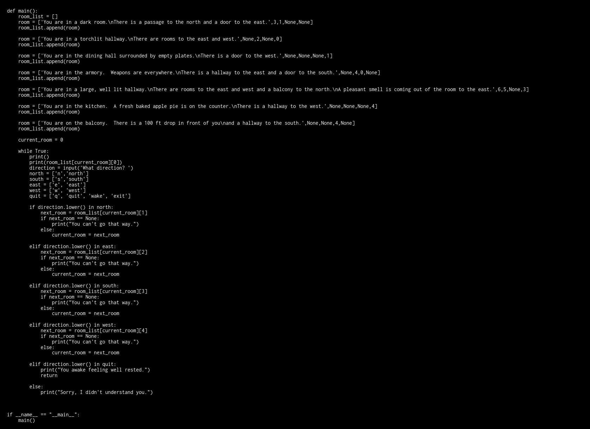

# CodeImager

CodeImager is a simple tool to convert a plain text file into an image file.

I use it to turn programs I have written into images so that students cannot just copy and paste my code, and instead have to type it in.

## Usage

To run from the command line:

`python imager.py <textfile> <imagefile>`

## Example
Original Text file: [adventure.py](./Example/adventure.py)

Resulting Image:

## Planned Features

* I would like to add syntax highlighting, but that is way off.
* Alternate color schemes
* A GUI interface allowing a text file to be loaded and an image preview?
* Better input validation 

 
